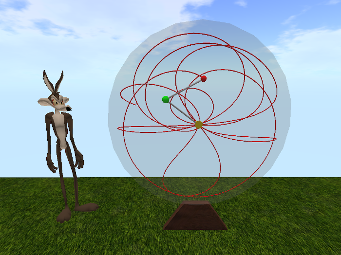
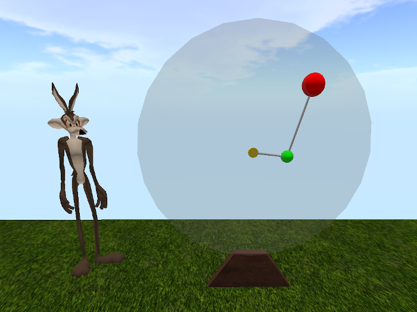
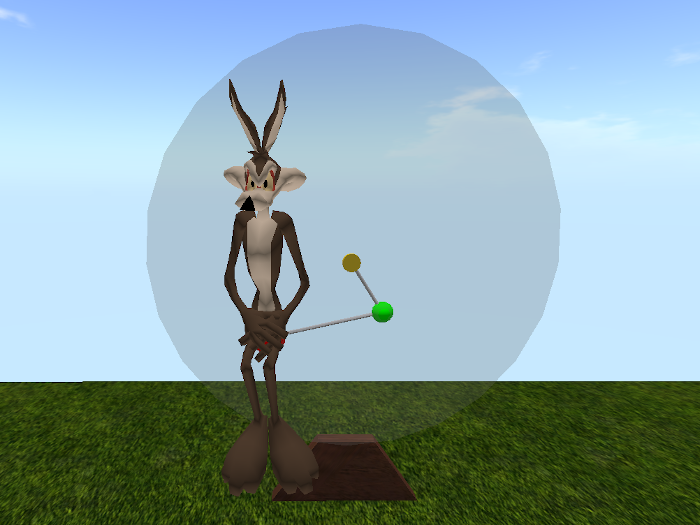
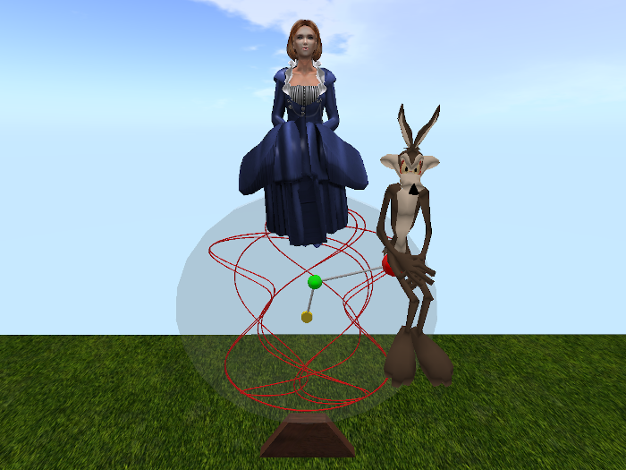

# Fourmilab Double Pendulum

[Fourmilab Double Pendulum](https://marketplace.secondlife.com/p/Fourmilab-Double-Pendulum/23992138)
is a physical model of a double pendulum system in which two masses
(“bobs”) swing on frictionless bearings on rods, with the first mass
connected to a fixed hub and the second mass swinging freely beneath
the first.  This simple system exhibits extraordinarily complicated and
chaotic motion, which varies dramatically as parameters of the system
(masses of the bobs, lengths of the rods, initial displacements of the
masses) are varied.  Fourmilab Double Pendulum models an ideal double
pendulum system, with no friction or air resistance, and allows you to
change the parameters of the model and observe the results.  Facilities
allow tracking the chaotic motion of the lower bob, displaying its path
as the system evolves.  The model is fully scriptable with commands
supplied in notecards in its inventory and scripts may define pop-up
menus through which an avatar may interact with the model.

This repository contains all of the software and resources, including
programs in Linden Scripting Language, notecards, and development
documentation, tools, and resources used in the model and its
development.  The actual model is built within Second Life and these
components are installed within it.

The
[complete package](https://marketplace.secondlife.com/p/Fourmilab-Double-Pendulum/23992138)
is available for free in the Second Life Marketplace.  This repository
contains everything in the model (except the prims, which are objects
built within Second Life), plus additional resources for developers who
may wish to extend or adapt the model as they wish.  The model is
delivered with "full permissions": those who obtain it are free to
copy, modify, and transfer it to other users within Second Life.

A [video demonstration](https://www.youtube.com/watch?v=TBA)
is available on YouTube.

All of this software is licensed under the Creative Commons
Attribution-ShareAlike license.  Please see
[LICENSE.md](LICENSE.md) in this repository for details.

Please see the
[Fourmilab Double Pendulum User Guide](notecards/double_pendulum_user_guide.nc)
for details.
